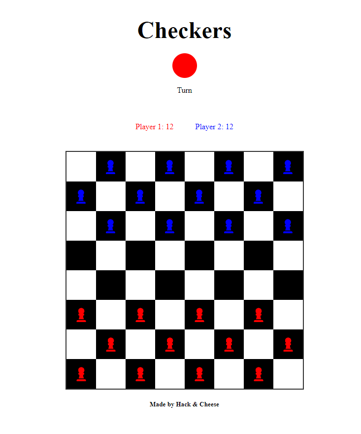
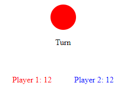

# Checkers Game


## Table of Contents
1. [Introduction](#introduction)
2. [Features](#features)
3. [Installation](#installation)
4. [Usage](#usage)
5. [Game Rules](#game-rules)
6. [Contributing](#contributing)
7. [License](#license)
8. [Acknowledgements](#acknowledgements)

## Introduction
Welcome to the Checkers Game! This project is a simple implementation of the classic board game, Checkers. It's designed to be easy to understand and expand upon, making it perfect for beginners and those looking to learn more about web development.

## Features
- **Interactive Board**: Click to select and move pieces.
- **Player Indicators**: Shows whose turn it is.
- **Counters**: Displays the number of remaining pieces for each player.
- **Responsive Design**: Works on different screen sizes.

 

## Installation
To get a copy of this project up and running on your local machine, follow these simple steps:

1. **Clone the repository**:
    ```sh
    git clone https://github.com/yourusername/checkers-game.git
    ```

2. **Navigate to the project directory**:
    ```sh
    cd checkers-game
    ```

3. **Open the `index.html` file** in your preferred web browser.


## Usage
Once you have the game open in your browser, follow these steps to play:

1. The game will randomly decide which player starts first.
2. Click on a piece to select it. Valid moves will be highlighted.
3. Click on the destination square to move the selected piece.
4. Capture opponent pieces by jumping over them.
5. The game automatically updates the piece counters and turn indicator.



## Game Rules
The game follows standard Checkers rules:

1. **Movement**: Pieces can move diagonally forward to an adjacent empty square.
2. **Capturing**: Capture opponent pieces by jumping over them to an empty square.
3. **Turns**: Players alternate turns. The game starts with Player 1.
4. **Winning**: The game ends when one player has no remaining pieces or cannot make a legal move.


## License
Distributed under the MIT License. See `LICENSE` for more information.

## Acknowledgements
- **Font Awesome** for icons: [Font Awesome](https://fontawesome.com/)
- **Made by Hack & Cheese**

 <!-- Replace with your logo image path -->
